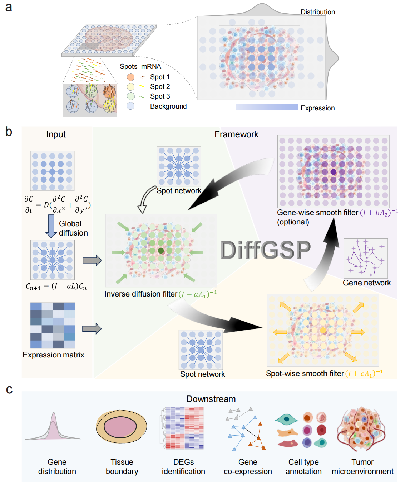

## About
```DiffGSP``` is a first-principles-based method that applies Fick’s law in combination with graph signal processing to mitigate molecular diffusion effects and denoise spatial transcriptomics data, thereby recovering true gene expression profiles. Owing to its exceptional adaptability, DiffGSP can be applied to various sequencing-based spatial transcriptomics platforms, thereby empowering researchers to unlock deeper biological insights and drive breakthroughs in spatial transcriptome research.

### DiffGSP advantages
1. DiffGSP can be applied to various sequencing-based spatial transcriptomics platforms.
2. DiffGSP is grounded in physical laws rather than data-driven or manual approaches.
3. DiffGSP can be applied in diverse downstream analysis tasks, with broad application prospects.



